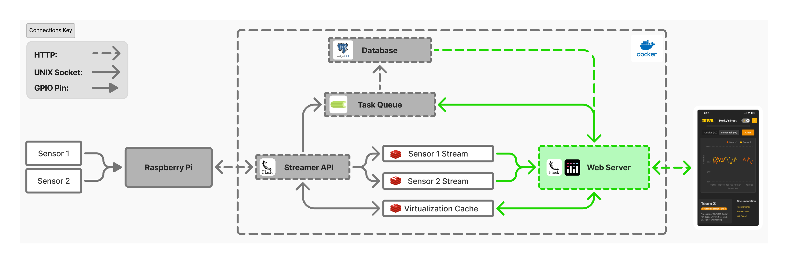

# L1-EXTENSION-web-application
Plotly Dash web application designed for mobile devices

  
  
<em>System Architecture</em>

## Responsibilities
- Consume Redis Streams for thermometer sensors 1 and 2
- Collect user information from PostgresSQL Database
- Interface with Streamer API with a shared cache to virtualize buttons
- Interface with a asynchonous Celery server to manage database deletions, insertions, and updates
- Serve dashboard to connected devices

## Key Libraries
**Plotly Dash**: 
- Flask web server that renders Python wrapped React components

**Dash Mantine Components**: 
- UI components and theme

**Dash Core Components**:
- Client side caching (dcc.Store)
- System synchronization (dcc.Interval)

**Pandas**:
- Data manipulation
